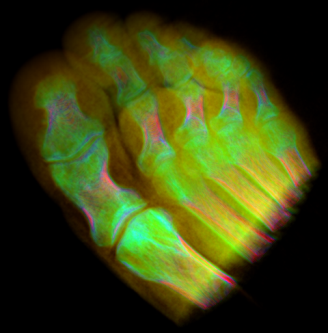
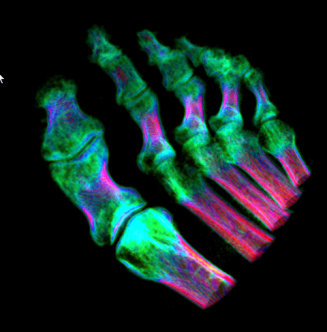
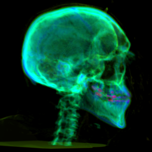

# volume-visualization
Automatically exported from code.google.com/p/volume-visualization

GPU Volume Raycasting and Transfer Functions Generation

This is a GPU ray-casting renderer with various features, including transfer functions, peeling, and importance driven rendering. We implemented our approach with OpenGL and GLSL (OpenGL Shading Language) on a personal computer equipped with an AMD Athlon 7750 Dual-Core processor, 4GB memory and a NVIDIA GeForce GT 240 graphics card. Experiments are conducted on several common datasets that are publicly available on the Volume Library. The original datasets in PVM format are converted into RAW format with the PVM tools distributed with the V^3 (Versatile Volume Viewer) volume rendering package.

## Examples
### Before and after applying the proposed techniques to the foot data set

### Before and after applying the proposed techniques to the vismale data set

======

## Papers related to this project:

Shengzhou Luo, Xiao Li, Jianhuang Wu, and Xin Ma, "Importance-driven volume rendering and gradient peeling," in International Conference on Computer Graphics Theory and Applications (GRAPP), Vilamoura, Portugal, 2011, pp. 211-214, poster presentation. https://www.scss.tcd.ie/~sluo/siat/GRAPP_2011_53_CR.pdf

Shengzhou Luo, Jianhuang Wu, Xiao Li, and Xin Ma, "Orientation visualizing transfer function for volume rendering," in Proceedings of International Conference on Bioscience, Biochemistry and Bioinformatics (ICBBB), Singapore, 2011, pp. 88-92. https://www.scss.tcd.ie/~sluo/siat/rp021_ICBBB2011-X00034.pdf

Xiao Li, Shengzhou Luo, Jianhuang Wu, and Xin Ma, "Gradient vector and local distribution based volume visualization," in IEEE International Conference on Complex Medical Engineering (CME), Harbin, China, 2011, pp. 317-322. https://www.scss.tcd.ie/~sluo/siat/xiao_li_cme_2011.pdf

Xiao Li, Jianhuang Wu, Shengzhou Luo, and Xin Ma, "Boundary emphasis transfer function generation based on HSL color space," in International Conference on Graphic and Image Processing (ICGIP), Manila, Philippines, 2010, pp. 46-50. https://www.scss.tcd.ie/~sluo/siat/xiao_li_icgip_2010.pdf

======

Screenshots are available at http://lsz0.wordpress.com/2010/09/07/a-volume-renderer-with-classification-peeling-and-boundary-emphasizing-2010/

Recent changes to this project can be found at https://bitbucket.org/lsz/volume-visualization.

If you are looking for a simple volume rendering program, check out our VTK and Qt based volume renderer at https://bitbucket.org/lsz/volume-renderer

======

BenBen's Story

You might interest in an autobiographic story by Ben (an author of this project). The story is regarded as a unique satire fable which reflects the people in a some kind of advanced institute (as it is claimed to be) located in a remote village that is somehow in a mess of utilitarianism which urge them to concern with matters of consequences that one never knows if it is actually important or not and important to what if it is important. [Here is the story](../../wiki/Story).
